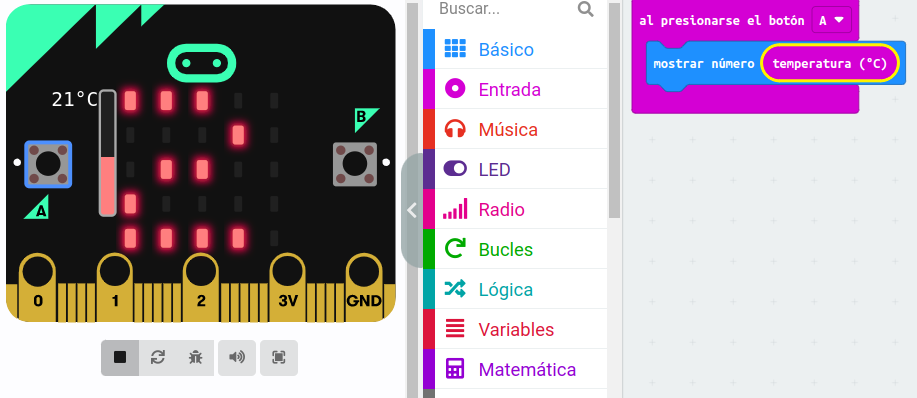
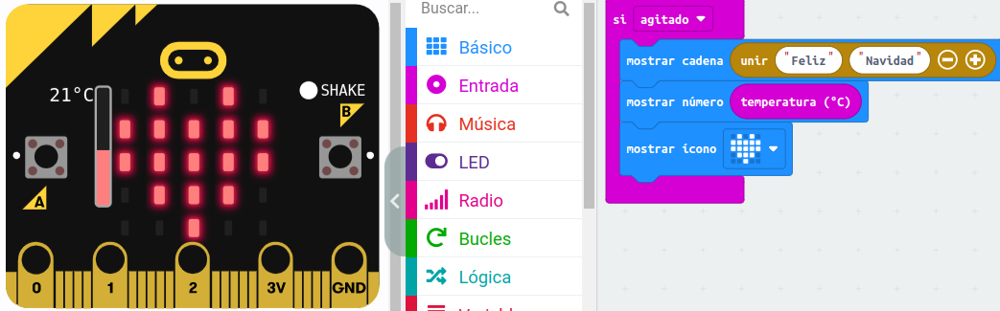

# Ejercicios Prácticos: Introducción a la placa micro:bit.

## Ejercicio 1.
En nuestro primer ejercicio, vamos a hacer que la placa muestre una cara feliz al pulsar el botón A, y una cara triste al pulsar el botón B.

## Ejercicio 2.
En este ejercicio vamos a utilizar el sensor de temperatura para mostrar sus valores en la pantalla al presionar los botones A y B.

## Ejercicio 3. 
Ahora vamos a diseñar un programa para que la micro:bit muestre en la pantalla un icono si es agitada.

